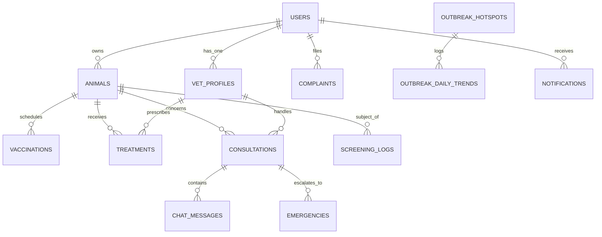

# PashuSakhi: Technical Architecture & Backend Specification Report

**Project:** PashuSakhi (Smart Livestock Healthcare & Epidemiological Surveillance System)  
**Competition:** Smart India Hackathon (SIH)  
**Context:** Technical analysis of the existing frontend prototype to design and implement a unified, production-ready backend.  
**Inspected Files:**
- `index.html` (Authentication, Multi-Language Onboarding & Role-Based Gatekeeper)
- `Farmer (4).html` / `PashuSakhi_Farmer_Dashboard_Final.html` (Farmer Web Application)
- `Vet_Fixed (2).html` / `PashuSakhi_Vet_Dashboard_Final.html` (Veterinarian Workspace & Clinical Surveillance)
- `PashuSakhi_Admin_Dashboard_Final.html` (Super Admin Governance, Outbreak Surveillance & Helpline Console)

---

## 1. Executive Summary

**PashuSakhi** is a comprehensive, digital livestock healthcare, telemedicine, and epidemiological surveillance ecosystem engineered for rural Indian animal husbandry. The platform connects three primary stakeholders:
1. **Livestock Farmers** who require animal health records, AI-assisted symptom screening, image-based disease detection, routine vaccination schedules, telemedicine consultations with certified veterinarians, and 24/7 access to the **1962 Pashu Sanjivini Emergency Helpline**.
2. **Veterinarians** who manage clinical caseloads, review automated AI triage reports, initiate telemedicine consultations, maintain patient treatment histories, and monitor regional disease vector outbreaks on interactive geospatial heat maps.
3. **Platform Administrators & Epidemiological Officers** who govern user verification, oversee veterinarian licensing, monitor platform throughput, track disease clusters across districts (specifically modeled on Western Maharashtra's dairy belts), triage citizen complaints, and coordinate 1962 mobile ambulance dispatches.

### Current State of the Codebase
The existing frontend consists of four standalone HTML documents:
- Two pages (`index.html` and `PashuSakhi_Admin_Dashboard_Final.html`) are constructed in **vanilla HTML5, CSS3, and JavaScript** with DOM manipulation and CDN-loaded Chart.js (v4.4.0).
- Two pages (`Farmer (4).html` and `Vet_Fixed (2).html`) are single-page **React 18** applications loaded via browser-level CDN import maps (`https://esm.sh/react@18.3.1`, Lucide icons) and compiled on the fly in the browser using `@babel/standalone`.
- **Zero Backend Connectivity:** All data is currently mock, hardcoded, or stored in fragmented `localStorage` keys (`psk_notifications`, `psk_profile`, `lumen_selected_language`, `users:<email>`). There is no cross-role communication: a consultation created by a farmer does not reach the veterinarian, and an outbreak alert flagged by an admin does not push notifications to affected farmers.
- **The Core Goal:** Transform this decoupled frontend prototype into a cohesive, secure, cloud-backed system by designing a robust RESTful API, centralized PostgreSQL database, JWT authentication with Role-Based Access Control (RBAC), real-time notification/chat pipelines (WebSockets), and an AI inference microservice wrapper.

---

## 2. Project Structure

```
pashusakhi-prototype/
├── index.html                           # Auth portal, language onboarding, role selection gatekeeper
├── Farmer (4).html                      # Farmer Dashboard (React 18 + Babel standalone via CDN)
│   └── (Identical: PashuSakhi_Farmer_Dashboard_Final.html)
├── Vet_Fixed (2).html                   # Vet Dashboard (React 18 + Babel standalone via CDN)
│   └── (Identical: PashuSakhi_Vet_Dashboard_Final.html)
├── PashuSakhi_Admin_Dashboard_Final.html# Admin Console (Vanilla JS, Chart.js 4.4.0, SVG Maps)
└── pashu-sakhi-auth/
    └── index.html                       # Prior iteration of portal auth
```

### Dependency Analysis
| File | Framework | Libraries & CDNs | State Management | Storage Mechanisms |
|---|---|---|---|---|
| `index.html` | Vanilla HTML5 / ES6 JS | FontAwesome 6.5.1, Google Fonts (Montserrat) | Local JS closures, CSS class switches | `localStorage` (`lumen_selected_language`, `users:<email>`, `session:current`, `pashusakhi_user`) |
| `Farmer (4).html` | React 18.3.1 (in-browser Babel) | Lucide-React 0.468.0, Google Fonts (Fraunces, Manrope) | React `useState`, `useMemo`, `useRef`, `useEffect` | `localStorage` (`psk_notifications`, `psk_profile`, `psk_language`, `psk_theme`, `psk_textSize`, `psk_highContrast`, `psk_notifPrefs`, `psk_reminderTiming`, `psk_animalSort`) |
| `Vet_Fixed (2).html` | React 18.3.1 (in-browser Babel) | Lucide-React 0.468.0, Google Fonts (Fraunces, Manrope) | React `useState`, `useMemo`, Context API (`LanguageContext`) | Transient component memory; minimal `localStorage` |
| `PashuSakhi_Admin_Dashboard_Final.html` | Vanilla HTML5 / ES6 JS | Chart.js 4.4.0, Google Fonts (Segoe UI) | Vanilla JS globals (`MOCK_DAILY`, `HM_HOTSPOTS`, `CI`) | `localStorage` (`pc-lang`, `pc-theme`, `pc-dark`, `pc-textsize`, `pc-contrast`) |

---

## 3. Page-by-Page Analysis

### 3.1 `index.html` — Portal Sign-In, Onboarding & Role-Based Routing
- **Intended Audience:** All users (Farmers, Veterinarians, Administrators).
- **Core Responsibilities:**
  1. **Landing/Welcome:** Visual branding with `#getStartedScreen` and `#getStartedBtn`.
  2. **Language Selection:** Selection among English (`en`), Hindi (`hi`), and Marathi (`mr`). Stored under `lumen_selected_language`.
  3. **Credentials Entry (`#mainAppWrapper`):**
     - Sign Up form (`#signUpForm`): inputs `#suName`, `#suEmail`, `#suPassword`.
     - Sign In form (`#signInForm`): inputs `#siEmail`, `#siPassword`, forgot password overlay (`#resetOverlay`).
  4. **Role Selection Gatekeeper (`#roleSelectionScreen`):**
     - Three interactive cards: `farmer`, `veterinarian`, `admin`.
     - 1962 Pashu Sanjivini Emergency Helpline banner (`tel:1962`).
     - Button `#roleContinueBtn` routes to:
       - `PashuSakhi_Farmer_Dashboard_Final.html`
       - `PashuSakhi_Vet_Dashboard_Final.html`
       - `PashuSakhi_Admin_Dashboard_Final.html`
- **Current Mock Logic:** Hashes password client-side using `crypto.subtle.digest('SHA-256', enc)` and stores user JSON in `localStorage.setItem('users:' + email.toLowerCase())`. Pre-seeds three demo accounts:
  - `farmer@pashusakhi.in` / `farmer123`
  - `vet@pashusakhi.in` / `vet12345`
  - `admin@pashucare.in` / `admin123`
- **Backend Requirements:**
  - `POST /api/v1/auth/register` (secure bcrypt password hashing on server, validation, JWT token issuance).
  - `POST /api/v1/auth/login` (rate-limited, returns token + role claim).
  - `POST /api/v1/auth/forgot-password` and `POST /api/v1/auth/reset-password` (tokenized password reset).
  - Centralized user session verification endpoint `GET /api/v1/auth/me`.

---

### 3.2 `Farmer (4).html` — Farmer Livestock Healthcare Dashboard
- **Intended Audience:** Dairy and livestock farmers.
- **Displayed Information:**
  - **Overview Banner:** Status aggregates (e.g., "3 healthy, 1 under treatment, 1 vaccination due").
  - **Animal Profile Cards:** Name, ear tag, species (Cow/Buffalo), breed, age, gender, health status badge (`healthy`, `attention`, `urgent`).
  - **Vaccination Tracker:** Vaccine name (FMD, HS, Brucellosis), due date, countdown in days.
  - **Active Treatments:** Condition diagnosed, start date, follow-up date, medication notes.
  - **Medical History Log:** Chronological record of screenings, treatments, and vaccinations.
  - **AI Screening & Disease Detection Results:** Risk severity badges, identified indicators, confidence scores, next-step recommendations, and prominent medical disclaimers.
  - **Telemedicine Chat:** Dialogue history with on-call veterinarian (Dr. Kavita Rao), quick action suggestion chips.
  - **Notifications:** Vaccination reminders, follow-up alerts, admin outbreak advisories.
  - **Farmer Profile & Settings:** Contact details, village/district, accessibility settings (9 languages, text scaling, dark/high-contrast themes).
- **User Actions:**
  - Register new animal (modal: name, species, breed, age, gender, upcoming vaccine, due date).
  - Remove animal (multi-select deletion with confirmation modal).
  - Run Symptom Screening (selects appetite, temperature, activity level, symptom chips, free-text notes).
  - Run Disease Detection (captures device camera photo or uploads image; simulates CV analysis).
  - Initiate chat with veterinarian and send pre-filled screening results.
  - Trigger 1962 Emergency Modal (requests immediate vet callback or opens emergency chat).
- **Backend Requirements:**
  - CRUD operations for livestock records (`/api/v1/animals`).
  - Storage of clinical treatments, history logs, and vaccination dates (`/api/v1/animals/:id/history`).
  - Image upload and storage in S3/MinIO for disease detection photos (`/api/v1/media/upload`).
  - Persistent chat message store (`/api/v1/consultations/:id/messages`) with WebSocket events.
  - Push notification retrieval and read status updates (`/api/v1/notifications`).

---

### 3.3 `Vet_Fixed (2).html` — Veterinarian Clinical Workspace & Surveillance Console
- **Intended Audience:** Licensed veterinary doctors, field veterinary officers, mobile clinic operators.
- **Displayed Information:**
  - **Workload Overview:** Unread chat requests, follow-ups due today, emergency cases pending, active cases.
  - **Geospatial Outbreak Heat Map (`DiseaseHeatmapDashboard`):**
    - Live surveillance banner with animated indicator.
    - District contour SVG map of Western Maharashtra (Nashik, Ahmednagar, Pune, Satara, Jalgaon).
    - Disease cluster pins with severity colors, case counts, and radiating risk zones (LSD, FMD, HS, PPR, BQ, Anthrax, Brucellosis).
    - Detailed Hotspot Inspector: affected animals, affected farms, weekly growth rate, spread dynamics narrative, clinical biosecurity protocol, 7-day sparkline bar chart.
    - 7-Day epidemiological trend curve (SVG line chart).
    - Escalating outbreak ranking matrix.
    - Support facilities & mobile units list (with distance in km, contact phone, ambulance availability).
  - **Chat Requests View:** Farmer consultation requests with animal details, reported symptoms, priority levels (`moderate`, `high`, `critical`), and status (`new`, `waiting`, `inConsultation`, `resolved`).
  - **AI Screening Reports Review:** List of farmer-submitted AI triage results with confidence metrics (e.g., 78% Mastitis, 86% Fungal Infection, 71% Foot Rot).
  - **Emergency Case Triage:** Critical emergencies (e.g., "Sheru — Bloated stomach, respiratory distress"), live timer, assigned vet status.
  - **Patient Medical Records:** Searchable registry across ear tags, owners, species, breeds, complete vaccination logs.
  - **Treatment History Log:** Comprehensive clinical ledger by patient with fields for condition, drug name, dosage, administration route, duration, follow-up date, notes.
- **User Actions:**
  - Toggle clinical availability status (`available`, `busy`, `emergencyOnly`, `offline`, `leave`).
  - Accept consultation requests and transition status (`new` → `inConsultation` → `resolved`).
  - Review AI triage reports, confirm assessment, or flag for manual physical checkup.
  - Triage emergencies: "Accept Case" (assigns vet) → "Start Treatment" → "Mark Resolved".
  - Add new clinical treatment entries (`addTreatment`).
  - Dispatch mobile veterinary units or 1962 emergency ambulances to outbreak hotspots.
- **Backend Requirements:**
  - Consultation triage workflow state machine (`/api/v1/consultations`).
  - Emergency incident dispatching and tracking (`/api/v1/emergencies`).
  - Prescription and clinical treatment creation (`/api/v1/treatments`).
  - Geospatial query endpoints for disease hotspots and nearby veterinary resources (`/api/v1/surveillance/hotspots`, `/api/v1/surveillance/responders`).

---

### 3.4 `PashuSakhi_Admin_Dashboard_Final.html` — Super Admin Console & Outbreak Command
- **Intended Audience:** Government livestock development officers, district animal husbandry directors, system administrators.
- **Displayed Information:**
  - **Global Platform KPIs:** Total Farmers (2,847), Total Veterinarians (164), Resolved Cases (4,206), Unresolved Complaints (2).
  - **Platform Growth Analytics (Chart.js):** New monthly registrations, active vs. inactive users, case resolution rates, emergency trends, livestock species distribution, disease ranking.
  - **Management Sub-Panels:**
    - *User Management:* Farmers and veterinarians with district, state, role, status.
    - *Case Monitoring:* Open cases, unassigned cases, emergency response times.
    - *Vet Monitoring & Licensing:* License verification statuses, ratings, caseloads.
    - *District Disease Surveillance:* Weekly case counts, percentage change (e.g., Nashik +38%), risk level.
    - *Complaint Management:* Citizen complaint log (response delays, misdiagnoses, billing, app bugs).
    - *Platform Health:* 1962 Helpline SLA (99.8%), AI low-confidence review queue, database uptime.
  - **Administrative Heat Map:** District-level hotspot monitoring, risk zone breakdown, 7/30-day spread trends, priority action ranking, and mobile vet dispatch triggers.
  - **Report Generation:** Export cards for User Growth, Case Resolution, Complaint Audit Log, Disease Map, Vet Performance, AI Confidence. Client-side CSV generation.
  - **Platform Governance Settings:** AI confidence threshold adjustment (default 60%), emergency response timeouts (15 min), max daily vet caseload, data retention policies, 2FA enforcement.
- **User Actions:**
  - Suspend, activate, or approve farmer/veterinarian accounts (`handleUserAction`).
  - Verify or reject pending veterinarian professional licenses (`handleVetVerify`).
  - Assign or fast-assign emergency cases to available veterinarians (`handleCaseAssign`).
  - Assign and resolve platform complaints (`handleComplaintAction`).
  - Filter analytics dynamically across time horizons (Week, Month, Custom Month).
  - Trigger 1962 ambulance dispatches to disease clusters.
  - Export system audit reports to CSV files.
- **Backend Requirements:**
  - Administrative oversight endpoints (`/api/v1/admin/users`, `/api/v1/admin/vets/verify`).
  - Aggregated analytics queries with SQL `GROUP BY` and date truncation (`/api/v1/admin/analytics`).
  - Complaint workflow tracking (`/api/v1/admin/complaints`).
  - System configuration management (`/api/v1/admin/settings`).

---

## 4. Users & Roles (Access Control Matrix)

```mermaid
graph TD
    User([Platform User]) -->|Role: farmer| FarmerRole[Farmer]
    User -->|Role: veterinarian| VetRole[Veterinarian]
    User -->|Role: admin| AdminRole[Super Admin / Officer]

    FarmerRole --> AnimalMgmt[Animal Registry & Health Cards]
    FarmerRole --> SymptomAI[AI Screening & Image Detection]
    FarmerRole --> ConsultReq[Telemedicine Consultation & Chat]
    FarmerRole --> Emer1962[1962 Emergency Callout]

    VetRole --> ConsultInbox[Consultation Triage Inbox]
    VetRole --> ClinicalRx[Clinical Treatment & Rx Ledger]
    VetRole --> EmerDispatch[Emergency Case Acceptance]
    VetRole --> VetHeatmap[District Outbreak Surveillance Map]

    AdminRole --> UserGov[User & Vet License Verification]
    AdminRole --> OutbreakGov[Outbreak Thresholds & Alerts]
    AdminRole --> PlatformHealth[1962 SLA & System Audits]
    AdminRole --> AnalyticsBI[Epidemiological BI & CSV Reports]
```



### Role 1: Farmer (`farmer`)
- **Responsibilities:** Register personal livestock, monitor health parameters, request vet consultations, report acute emergencies.
- **Accessible Screens:** Landing/Login (`index.html`), Farmer Dashboard (`Farmer (4).html`), Animal Detail, AI Screening, AI Disease Detection, Telemedicine Chat, Notifications, Profile, Settings.
- **Allowed Actions:**
  - Create, view, update, and soft-delete owned animals.
  - Run rule-based symptom screenings and upload animal images for disease detection.
  - Open consultation requests and send messages to assigned veterinarians.
  - Trigger emergency SOS incidents.
  - Update personal farmer profile (name, mobile number, village location).
- **Prohibited Actions:**
  - Cannot access veterinarian patient lists or alter medical diagnoses.
  - Cannot access admin user management, vet verification, or complaint queues.
  - Cannot view or edit other farmers' livestock or chat conversations.
  - Cannot access the full technical administrative outbreak console.

### Role 2: Veterinarian (`veterinarian`)
- **Responsibilities:** Provide clinical guidance, verify AI triage reports, administer prescriptions, handle emergency cases, track regional disease spread.
- **Accessible Screens:** Landing/Login (`index.html`), Veterinarian Dashboard (`Vet_Fixed (2).html`), Clinical Overview, Heat Map, Chat Requests, AI Reports, Emergency Cases, Patient Records, Treatment History, Settings.
- **Allowed Actions:**
  - View incoming consultation requests and accept/reject them.
  - Conduct live chats with farmers regarding assigned animal cases.
  - Create and append clinical treatment records (drug name, dosage, route, duration, notes).
  - Review and confirm or reclassify AI triage predictions.
  - Accept emergency dispatches and mark cases as `inTreatment` or `resolved`.
  - View regional disease hotspots and request mobile support unit deployments.
  - Update professional availability (`available`, `busy`, `emergencyOnly`, `offline`, `leave`).
- **Prohibited Actions:**
  - Cannot verify or suspend other veterinarians' medical credentials.
  - Cannot delete platform-wide animal medical records or complaint records.
  - Cannot access global platform administrative analytics or system configuration.

### Role 3: Super Admin (`admin`)
- **Responsibilities:** Platform governance, veterinary license compliance, national 1962 helpline SLA tracking, outbreak response coordination, system configuration.
- **Accessible Screens:** Landing/Login (`index.html`), Admin Console (`PashuSakhi_Admin_Dashboard_Final.html`), Management, Analytics, Farmers, Veterinarians, Heat Map, Cases, Reports, Settings.
- **Allowed Actions:**
  - Approve, verify, reject, or suspend farmer and veterinarian accounts.
  - Assign or reassign unhandled cases and emergencies to veterinarians.
  - Manage citizen complaints (assign to admin staff, mark resolved).
  - Configure platform parameters (AI confidence thresholds, emergency timeouts, data retention).
  - Generate and export CSV audit reports.
  - Publish regional disease advisories to farmers.
- **Prohibited Actions:**
  - Does not directly create personal livestock records.
  - Should not impersonate veterinarians during direct medical consultations.

---

## 5. Feature Inventory & Backend Requirement Matrix

| # | Feature / UI Component | UI Location | Classification | Justification |
|---|---|---|---|---|
| 1 | **Language Onboarding & Switcher** | `index.html`, Farmer & Vet Settings | **Frontend-Only** (with profile sync) | Text translation dictionary (`translations`) is loaded on client. User's language preference must be persisted to user profile via API. |
| 2 | **User Authentication & RBAC** | `index.html` | **Requires Backend + Database + Auth** | Password verification, password reset tokens, JWT issuance with signed role claims (`farmer`, `veterinarian`, `admin`). |
| 3 | **Animal Registration & Profile** | `Farmer (4).html` (Add Animal Modal) | **Requires Backend + Database** | Livestock ear-tag records, species, age, gender, ownership linkage must be permanently stored in DB. |
| 4 | **Animal Soft-Deletion** | `Farmer (4).html` (Remove Animal) | **Requires Backend + Database** | Deleting animals must preserve historical treatments and outbreak records using a `deleted_at` timestamp. |
| 5 | **Vaccination Tracker & Reminders** | Farmer Overview, Vet Patient Records | **Requires Database + Background Worker** | Due dates must be calculated by the server; cron jobs must evaluate `isReminderDue` and dispatch automated push notifications. |
| 6 | **Active Treatment Tracking** | Farmer & Vet Dashboards | **Requires Backend + Database** | Ongoing clinical courses, antibiotic durations, and follow-up milestones must be queryable across roles. |
| 7 | **AI Symptom Screening** | `Farmer (4).html` (`ScreeningView`) | **Backend / ML Microservice** | Rule-based triage can run on client, but clinical inputs, results, and recommendations must be logged to database for auditability. |
| 8 | **AI Image-Based Disease Detection** | `Farmer (4).html` (`DiseaseDetectionView`) | **Requires Backend + File Storage + AI/ML** | Photo uploads must be stored in object storage (S3/MinIO); images passed to a Computer Vision model (e.g., PyTorch/ONNX service); inference results logged to DB. |
| 9 | **Telemedicine Consultation & Chat** | `Farmer (4).html` & `Vet_Fixed (2).html` | **Requires Backend + Database + WebSockets** | Chat messages between farmer and vet must be stored in database and delivered via WebSocket/Socket.io channels. |
| 10 | **Emergency Case Dispatch (1962 SOS)** | Emergency Modals across all dashboards | **Requires Backend + Database + Push/SMS** | High-priority case creation, automated vet notification, response timer tracking, and integration with 1962 call center dispatch. |
| 11 | **Disease Hotspot & Surveillance Map** | `Vet_Fixed (2).html` & Admin Heat Map | **Requires Backend + Database (PostGIS)** | Outbreak clusters, active case densities, infected farm counts, and contagion radius calculation must be dynamically queried. |
| 12 | **Mobile Vet Dispatching** | Vet & Admin Heat Maps | **Requires Backend + Database** | Assigning an ambulance or field clinician to an outbreak cluster requires operational state updates in DB. |
| 13 | **Veterinary License Verification** | Admin Console (`handleVetVerify`) | **Requires Backend + Database + Storage** | Registration numbers (`MH-VET-XXXXX`) and document uploads must be verified by admin before allowing medical practice. |
| 14 | **Citizen Complaints Management** | Admin Console (`handleComplaintAction`) | **Requires Backend + Database** | Ticketing workflow: submission, admin assignment, status updates (`New` → `Under Review` → `Resolved`), audit notes. |
| 15 | **Epidemiological BI & CSV Export** | Admin Analytics & Reports | **Requires Backend + Database** | Aggregations across dates, districts, species, and outcomes; generation of downloadable CSV/PDF reports. |

---

## 6. Data Model / Entity Relationship Architecture



### 6.1 `users`
- **Purpose:** Primary identity table for authentication and profile management across all roles.
- **Fields:**
  - `id`: `UUID`, Primary Key, Required. (e.g., `a0eebc99-9c0b-4ef8-bb6d-6bb9bd380a11`)
  - `name`: `VARCHAR(120)`, Required. (e.g., `Suresh Patil` or `Dr. Aditi Kulkarni`)
  - `email`: `VARCHAR(180)`, Unique, Required. (e.g., `farmer@pashusakhi.in`)
  - `mobile`: `VARCHAR(20)`, Nullable. (e.g., `+91 98765 43210`)
  - `password_hash`: `VARCHAR(255)`, Required. (Bcrypt hashed)
  - `role`: `ENUM('farmer', 'veterinarian', 'admin')`, Required.
  - `status`: `ENUM('active', 'inactive', 'suspended', 'pending_approval')`, Default `'active'`.
  - `village_location`: `VARCHAR(255)`, Nullable. (e.g., `Wagholi, Pune District, Maharashtra`)
  - `preferred_language`: `VARCHAR(10)`, Default `'en'`. (`en`, `hi`, `mr`, etc.)
  - `theme`: `VARCHAR(20)`, Default `'system'`. (`light`, `dark`, `system`)
  - `high_contrast`: `BOOLEAN`, Default `FALSE`.
  - `created_at`: `TIMESTAMPTZ`, Default `NOW()`.
  - `updated_at`: `TIMESTAMPTZ`, Default `NOW()`.
  - `deleted_at`: `TIMESTAMPTZ`, Nullable (Soft delete).
- **Access:** Created by Self (Sign Up) or Admin; Viewed by Self & Admin; Updated by Self & Admin; Soft-deleted by Admin or Self.

---

### 6.2 `vet_profiles`
- **Purpose:** Professional veterinary credentials, availability status, and clinical affiliation.
- **Fields:**
  - `id`: `UUID`, Primary Key, Required.
  - `user_id`: `UUID`, Foreign Key (`users.id`), Unique, Required.
  - `registration_number`: `VARCHAR(50)`, Unique, Required. (e.g., `MH-VET-20394`)
  - `qualification`: `VARCHAR(100)`, Required. (e.g., `BVSc & AH`, `MVSc`)
  - `specialization`: `VARCHAR(150)`, Nullable. (e.g., `Large Animal Medicine & Reproduction`)
  - `clinic_affiliation`: `VARCHAR(200)`, Nullable. (e.g., `Pashu Sakhi Zonal Health Center, Nashik`)
  - `service_area`: `VARCHAR(200)`, Nullable. (e.g., `Nashik & Igatpuri Taluka`)
  - `experience_years`: `INTEGER`, Default `0`.
  - `verified_license`: `BOOLEAN`, Default `FALSE`.
  - `availability`: `ENUM('available', 'busy', 'emergencyOnly', 'offline', 'leave')`, Default `'available'`.
  - `rating_avg`: `NUMERIC(3,2)`, Default `5.00`.
  - `total_cases_handled`: `INTEGER`, Default `0`.
  - `units_available`: `VARCHAR(150)`, Nullable. (e.g., `1 Mobile Surgical Van`)
  - `created_at`: `TIMESTAMPTZ`, Default `NOW()`.
  - `updated_at`: `TIMESTAMPTZ`, Default `NOW()`.
- **Access:** Created by Veterinarian on onboarding; Viewed by All; Updated by Veterinarian & Admin; Verified by Admin.

---

### 6.3 `animals`
- **Purpose:** Registry of farmer livestock (cattle, buffaloes, goats, etc.).
- **Fields:**
  - `id`: `UUID`, Primary Key, Required.
  - `owner_id`: `UUID`, Foreign Key (`users.id`), Required.
  - `ear_tag`: `VARCHAR(50)`, Nullable. (e.g., `MH-NSK-0417`)
  - `name`: `VARCHAR(100)`, Required. (e.g., `Gauri`)
  - `species`: `VARCHAR(50)`, Required. (e.g., `Cow`, `Buffalo`, `Goat`, `Sheep`)
  - `breed`: `VARCHAR(80)`, Required. (e.g., `Gir`, `Murrah`, `Sahiwal`, `Sirohi`)
  - `age_years`: `NUMERIC(4,1)`, Required. (e.g., `4.5`)
  - `gender`: `ENUM('Female', 'Male')`, Required.
  - `health_status`: `ENUM('healthy', 'attention', 'urgent')`, Default `'healthy'`.
  - `avatar_url`: `VARCHAR(255)`, Nullable.
  - `created_at`: `TIMESTAMPTZ`, Default `NOW()`.
  - `updated_at`: `TIMESTAMPTZ`, Default `NOW()`.
  - `deleted_at`: `TIMESTAMPTZ`, Nullable (Soft delete).
- **Access:** Created by Farmer; Viewed by Owner Farmer, Assigned Vet, & Admin; Updated by Farmer & Vet; Soft-deleted by Farmer.

---

### 6.4 `vaccinations`
- **Purpose:** Vaccination schedules, scheduled reminders, and completion logs.
- **Fields:**
  - `id`: `UUID`, Primary Key, Required.
  - `animal_id`: `UUID`, Foreign Key (`animals.id`), Required.
  - `vaccine_name`: `VARCHAR(120)`, Required. (e.g., `FMD (Foot & Mouth Disease)`, `HS`, `Brucellosis`)
  - `due_date`: `DATE`, Required. (e.g., `2026-09-12`)
  - `completed_date`: `DATE`, Nullable. (e.g., `2026-08-20`)
  - `status`: `ENUM('due', 'completed', 'overdue')`, Default `'due'`.
  - `batch_number`: `VARCHAR(50)`, Nullable.
  - `administered_by`: `UUID`, Foreign Key (`users.id`), Nullable.
  - `created_at`: `TIMESTAMPTZ`, Default `NOW()`.
- **Access:** Created by Farmer or Vet; Viewed by Owner Farmer, Vet, & Admin; Updated by Vet or Farmer.

---

### 6.5 `treatments`
- **Purpose:** Medical diagnosis, prescription details, antibiotic courses, and follow-ups.
- **Fields:**
  - `id`: `UUID`, Primary Key, Required.
  - `animal_id`: `UUID`, Foreign Key (`animals.id`), Required.
  - `prescribed_by`: `UUID`, Foreign Key (`users.id`), Nullable.
  - `condition_diagnosed`: `VARCHAR(200)`, Required. (e.g., `Bovine Mastitis (Early Stage)`, `Foot Rot`)
  - `medicine_prescribed`: `TEXT`, Nullable. (e.g., `Intramammary Infusion Cloxacillin, 200mg`)
  - `dosage`: `VARCHAR(100)`, Nullable. (e.g., `2 ml`, `Single dose`)
  - `route`: `VARCHAR(50)`, Nullable. (e.g., `Intramammary`, `SC`, `Oral`)
  - `duration`: `VARCHAR(50)`, Nullable. (e.g., `5 days`, `Single dose`)
  - `clinical_notes`: `TEXT`, Nullable.
  - `start_date`: `DATE`, Default `CURRENT_DATE`.
  - `follow_up_date`: `DATE`, Nullable.
  - `status`: `ENUM('active', 'completed', 'discontinued')`, Default `'active'`.
  - `attachments_count`: `INTEGER`, Default `0`.
  - `created_at`: `TIMESTAMPTZ`, Default `NOW()`.
- **Access:** Created by Veterinarian; Viewed by Owner Farmer, Treating Vet, & Admin; Updated by Veterinarian.

---

### 6.6 `consultations`
- **Purpose:** Telemedicine session between farmer and veterinarian.
- **Fields:**
  - `id`: `VARCHAR(30)`, Primary Key, Required. (e.g., `REQ-2041`, `C-4208`)
  - `farmer_id`: `UUID`, Foreign Key (`users.id`), Required.
  - `animal_id`: `UUID`, Foreign Key (`animals.id`), Required.
  - `assigned_vet_id`: `UUID`, Foreign Key (`users.id`), Nullable.
  - `symptoms_summary`: `TEXT`, Required.
  - `image_url`: `VARCHAR(255)`, Nullable.
  - `priority`: `ENUM('low', 'moderate', 'high', 'critical')`, Default `'moderate'`.
  - `status`: `ENUM('new', 'unread', 'waiting', 'inConsultation', 'resolved')`, Default `'new'`.
  - `resolved_at`: `TIMESTAMPTZ`, Nullable.
  - `created_at`: `TIMESTAMPTZ`, Default `NOW()`.
  - `updated_at`: `TIMESTAMPTZ`, Default `NOW()`.
- **Access:** Created by Farmer; Viewed by Farmer, Assigned Vet, & Admin; Updated by Vet & Admin.

---

### 6.7 `chat_messages`
- **Purpose:** Messages within a consultation session.
- **Fields:**
  - `id`: `UUID`, Primary Key, Required.
  - `consultation_id`: `VARCHAR(30)`, Foreign Key (`consultations.id`), Required.
  - `sender_id`: `UUID`, Foreign Key (`users.id`), Required.
  - `sender_role`: `ENUM('farmer', 'veterinarian')`, Required.
  - `message_text`: `TEXT`, Required.
  - `category`: `VARCHAR(50)`, Default `'general'`. (`symptoms`, `treatment`, `vaccination`, `screening`, `diseaseDetection`)
  - `created_at`: `TIMESTAMPTZ`, Default `NOW()`.
- **Access:** Created by Farmer or Vet in session; Viewed by Consultation participants & Admin.

---

### 6.8 `screening_logs` (AI Symptom & Image Screenings)
- **Purpose:** Audit record of AI symptom evaluations and image-based disease detections.
- **Fields:**
  - `id`: `VARCHAR(30)`, Primary Key, Required. (e.g., `AR-3311`)
  - `animal_id`: `UUID`, Foreign Key (`animals.id`), Required.
  - `farmer_id`: `UUID`, Foreign Key (`users.id`), Required.
  - `screening_type`: `ENUM('symptom_triage', 'image_detection')`, Required.
  - `image_url`: `VARCHAR(255)`, Nullable.
  - `reported_symptoms`: `JSONB`, Nullable. (e.g., `["sym_fever", "sym_lossOfAppetite"]`)
  - `temperature_selected`: `VARCHAR(30)`, Nullable.
  - `appetite_selected`: `VARCHAR(30)`, Nullable.
  - `activity_selected`: `VARCHAR(30)`, Nullable.
  - `notes`: `TEXT`, Nullable.
  - `ai_predicted_condition`: `VARCHAR(200)`, Required. (e.g., `Suspected Bovine Dermatitis`, `Mastitis`)
  - `confidence_score`: `INTEGER`, Required. (0 to 100)
  - `risk_level`: `ENUM('healthy', 'attention', 'urgent')`, Required.
  - `status`: `ENUM('New', 'Under Review', 'Resolved')`, Default `'New'`.
  - `reviewed_by_vet_id`: `UUID`, Foreign Key (`users.id`), Nullable.
  - `vet_review_notes`: `TEXT`, Nullable.
  - `created_at`: `TIMESTAMPTZ`, Default `NOW()`.
- **Access:** Created by Farmer (via inference); Viewed by Farmer, Vet, & Admin; Updated by Vet (review/confirm) & Admin.

---

### 6.9 `emergencies`
- **Purpose:** Critical incident reports escalated to veterinarians or the 1962 dispatch network.
- **Fields:**
  - `id`: `VARCHAR(30)`, Primary Key, Required. (e.g., `EMG-0512`, `E-1042`)
  - `animal_id`: `UUID`, Foreign Key (`animals.id`), Required.
  - `farmer_id`: `UUID`, Foreign Key (`users.id`), Required.
  - `assigned_vet_id`: `UUID`, Foreign Key (`users.id`), Nullable.
  - `symptoms`: `TEXT`, Required.
  - `ai_triage_result`: `VARCHAR(255)`, Nullable.
  - `severity`: `ENUM('moderate', 'critical')`, Default `'critical'`.
  - `status`: `ENUM('new', 'accepted', 'inTreatment', 'resolved')`, Default `'new'`.
  - `response_time_seconds`: `INTEGER`, Nullable.
  - `is_1962_helpline_inbound`: `BOOLEAN`, Default `FALSE`.
  - `created_at`: `TIMESTAMPTZ`, Default `NOW()`.
  - `resolved_at`: `TIMESTAMPTZ`, Nullable.
- **Access:** Created by Farmer; Viewed by Farmers, All Active Vets, & Admin; Updated by Vet & Admin.

---

### 6.10 `outbreak_hotspots`
- **Purpose:** Geographical disease cluster nodes monitored in Vet and Admin Heat Maps.
- **Fields:**
  - `id`: `VARCHAR(30)`, Primary Key, Required. (e.g., `HS-01`, `nashik`)
  - `district`: `VARCHAR(100)`, Required. (e.g., `Nashik`, `Pune`, `Ahmednagar`)
  - `taluka_location`: `VARCHAR(200)`, Required. (e.g., `Sinnar & Dodi Taluka`)
  - `disease_name`: `VARCHAR(150)`, Required. (e.g., `Lumpy Skin Disease (LSD)`)
  - `disease_category`: `VARCHAR(50)`, Required. (e.g., `LSD`, `FMD`, `HS`, `PPR`, `Anthrax`)
  - `risk_level`: `ENUM('critical', 'high', 'medium', 'low')`, Required.
  - `status`: `ENUM('Confirmed', 'Suspected', 'Active', 'Contained', 'Resolved')`, Required.
  - `latitude`: `NUMERIC(10,6)`, Nullable.
  - `longitude`: `NUMERIC(10,6)`, Nullable.
  - `map_x`: `INTEGER`, Required. (Relative coordinate for SVG renderer)
  - `map_y`: `INTEGER`, Required.
  - `radius_km`: `NUMERIC(5,2)`, Default `10.00`.
  - `affected_animals_count`: `INTEGER`, Default `0`.
  - `affected_farms_count`: `INTEGER`, Default `0`.
  - `species_affected`: `VARCHAR(150)`, Nullable.
  - `recent_increase_pct`: `VARCHAR(20)`, Default `"+0%"`.
  - `spread_summary`: `TEXT`, Nullable.
  - `recommended_advisory`: `TEXT`, Nullable.
  - `is_new_outbreak`: `BOOLEAN`, Default `FALSE`.
  - `created_at`: `TIMESTAMPTZ`, Default `NOW()`.
  - `updated_at`: `TIMESTAMPTZ`, Default `NOW()`.
- **Access:** Created by Admin/Veterinary Officer; Viewed by Vet & Admin; Filtered summaries sent to Farmers as advisories.

---

### 6.11 `complaints`
- **Purpose:** Citizen and farmer grievance ticketing system.
- **Fields:**
  - `id`: `VARCHAR(30)`, Primary Key, Required. (e.g., `CP-074`)
  - `submitted_by_id`: `UUID`, Foreign Key (`users.id`), Required.
  - `category`: `VARCHAR(100)`, Required. (e.g., `Vet Response Delay`, `Wrong Diagnosis`, `App Issues`, `Billing`)
  - `assigned_to_id`: `UUID`, Foreign Key (`users.id`), Nullable. (Admin staff)
  - `status`: `ENUM('New', 'Under Review', 'Resolved')`, Default `'New'`.
  - `description`: `TEXT`, Required.
  - `resolution_notes`: `TEXT`, Nullable.
  - `created_at`: `TIMESTAMPTZ`, Default `NOW()`.
  - `resolved_at`: `TIMESTAMPTZ`, Nullable.
- **Access:** Created by Farmer/User; Viewed by Submitter & Admin; Updated by Admin.

---

### 6.12 `notifications`
- **Purpose:** Centralized push and in-app notification ledger.
- **Fields:**
  - `id`: `UUID`, Primary Key, Required.
  - `recipient_id`: `UUID`, Foreign Key (`users.id`), Required.
  - `recipient_role`: `ENUM('farmer', 'veterinarian', 'admin')`, Required.
  - `category`: `VARCHAR(50)`, Required. (`vaccination`, `treatment`, `screening`, `consultation`, `emergency`, `outbreak_advisory`)
  - `animal_id`: `UUID`, Foreign Key (`animals.id`), Nullable.
  - `title`: `VARCHAR(255)`, Required.
  - `message`: `TEXT`, Required.
  - `read`: `BOOLEAN`, Default `FALSE`.
  - `reference_id`: `VARCHAR(50)`, Nullable. (Case ID, Hotspot ID, etc.)
  - `created_at`: `TIMESTAMPTZ`, Default `NOW()`.
- **Access:** Created by System / Event triggers; Viewed by Recipient User; Marked read by Recipient.

---

## 7. Frontend → Backend Mapping

| Frontend Page / Component | UI Action / Trigger | Current Client Behavior | Backend Service Required | Target Database Entity | Proposed API Endpoint |
|---|---|---|---|---|---|
| `index.html` (Sign In) | Click `#siSubmitBtn` | Reads `users:<email>` from `localStorage`; compares SHA-256 hash | Authentication Controller | `users` | `POST /api/v1/auth/login` |
| `index.html` (Sign Up) | Click `#suSubmitBtn` → `#roleContinueBtn` | Saves user JSON into `localStorage` with role | User Service | `users` | `POST /api/v1/auth/register` |
| `index.html` (Password Reset) | Click `#rpSubmitBtn` | Overwrites hash in `localStorage` | Auth Service | `users` | `POST /api/v1/auth/reset-password` |
| `Farmer (4).html` (Overview) | Component Mount (`useEffect`) | Reads static `initialAnimals` & `summary` | Livestock Service | `animals`, `vaccinations`, `treatments` | `GET /api/v1/farmer/dashboard-summary` |
| `Farmer (4).html` (Add Animal) | Submit in `AddAnimalModal` | Prepends animal to React `useState` array | Livestock Service | `animals`, `vaccinations` | `POST /api/v1/animals` |
| `Farmer (4).html` (Delete Animal) | Confirm in Delete Modal | Filters out IDs from React `useState` | Livestock Service | `animals` (soft delete) | `DELETE /api/v1/animals/batch` |
| `Farmer (4).html` (AI Symptom Triage) | Click "Submit for screening" | Runs local `runScreening()` scoring function | Diagnostics Service | `screening_logs`, `animals` | `POST /api/v1/diagnostics/symptoms` |
| `Farmer (4).html` (AI Disease Photo) | Click "Analyze Animal Photo" | Simulates 1.35s delay, returns static mock result | Computer Vision ML Service | `screening_logs`, media storage | `POST /api/v1/diagnostics/image` |
| `Farmer (4).html` (Chat Send) | Click Send / Quick Action chip | Appends message to local `chats` object, triggers mock bot reply | Consultation Service | `chat_messages`, `consultations` | `POST /api/v1/consultations/:id/messages` |
| `Farmer (4).html` (Emergency) | Click "Contact vet" / "Start consult" | Shows toast or opens chat in local state | Emergency Incident Service | `emergencies`, `consultations` | `POST /api/v1/emergencies` |
| `Farmer (4).html` (Notifications) | Click on notification card | Updates `read: true` in local state, navigates | Notification Service | `notifications` | `PATCH /api/v1/notifications/:id/read` |
| `Farmer (4).html` (Profile) | Save edited profile fields | Writes updated object to `localStorage.setItem("psk_profile")` | User Service | `users` | `PUT /api/v1/users/profile` |
| `Vet_Fixed (2).html` (Overview) | Component Mount (`useEffect`) | Calculates counts from static mock arrays | Vet Service | `consultations`, `emergencies`, `treatments` | `GET /api/v1/vet/dashboard-summary` |
| `Vet_Fixed (2).html` (Availability) | Change select dropdown | Updates `availability` in local React state | Vet Service | `vet_profiles` | `PATCH /api/v1/vet/availability` |
| `Vet_Fixed (2).html` (Chat Requests) | Click "Open Case" | Opens local mock conversation | Consultation Service | `consultations`, `chat_messages` | `GET /api/v1/consultations/:id` |
| `Vet_Fixed (2).html` (AI Reports) | Click "Confirm" / "Under Review" | Updates status field in `reports` array | Diagnostics Service | `screening_logs` | `PATCH /api/v1/diagnostics/:id/status` |
| `Vet_Fixed (2).html` (Emergency Triage) | Click "Accept Case" | Sets status to `accepted`, assigns Dr. Aditi | Emergency Service | `emergencies` | `POST /api/v1/emergencies/:id/accept` |
| `Vet_Fixed (2).html` (New Treatment) | Click "New Treatment" button | Appends treatment record to `treatmentHistory` | Clinical Record Service | `treatments` | `POST /api/v1/treatments` |
| `Vet_Fixed (2).html` (Dispatch Vet) | Click "Dispatch Nearest Vet" | Displays toast alert | Outbreak Service | `outbreak_hotspots`, `emergencies` | `POST /api/v1/surveillance/hotspots/:id/dispatch` |
| `PashuSakhi_Admin_Dashboard_Final.html` | Page load / Tab change | Reads `chartData`, `MOCK_DAILY`, `HM_HOTSPOTS` | Analytics & BI Service | `users`, `consultations`, `outbreak_hotspots` | `GET /api/v1/admin/analytics/overview` |
| Admin Console (User Mgmt) | Click "Suspend" / "Activate" | Directly modifies DOM table row pill class | User Governance | `users` | `PATCH /api/v1/admin/users/:id/status` |
| Admin Console (Vet Verify) | Click "Verify" / "Reject" | Updates table cell text and pending counter | Compliance Service | `vet_profiles` | `PATCH /api/v1/admin/vets/:id/verify` |
| Admin Console (Case Assign) | Click "Assign Vet" / "Fast Assign" | Inserts vet name into DOM table cell | Case Management | `consultations`, `emergencies` | `POST /api/v1/admin/cases/:id/assign` |
| Admin Console (Complaints) | Click "Assign" / "Resolve" | Modifies DOM cell text and KPI counters | Grievance Service | `complaints` | `PATCH /api/v1/admin/complaints/:id` |
| Admin Console (Report Export) | Click "Export" button | Assembles client-side CSV data URI string | Reporting Service | Aggregated data | `GET /api/v1/admin/reports/:reportType/export` |

---

## 8. Backend API Requirements

All endpoints must be prefixed with `/api/v1`. Responses must use a standardized JSON wrapper:
```json
{
  "success": true,
  "statusCode": 200,
  "message": "Operation completed successfully.",
  "data": { ... },
  "error": null
}
```

### 8.1 Authentication & Authorization (`/api/v1/auth`)
- `POST /register`: Registers user (`name`, `email`, `password`, `role`, `village_location`, `preferred_language`). Validates password length (>= 8 chars), returns JWT token.
- `POST /login`: Validates credentials, checks account status (rejects suspended accounts), returns signed JWT (`id`, `role`, `name`, `email`) and user object.
- `GET /me`: Returns authenticated user's current session profile.
- `POST /forgot-password`: Generates secure password reset token (valid for 15 minutes), sends email/SMS.
- `POST /reset-password`: Validates token and updates user `password_hash`.
- `POST /logout`: Invalidates refresh token / session cookie.

### 8.2 Livestock & Animal Registry (`/api/v1/animals`)
- `GET /`: Lists all animals belonging to current farmer (or filtered by farmer for vets/admins). Supports query params `?search=&sortBy=name|health|vaccination|age|recent`.
- `POST /`: Creates new animal record. Body: `{ name, species, breed, age_years, gender, initial_vaccine_name, initial_vaccine_date }`.
- `GET /:id`: Retrieves complete animal health card, including owner details, latest screening, upcoming vaccines, and active treatments.
- `PUT /:id`: Updates animal metadata (name, breed, age, health status).
- `DELETE /:id`: Soft-deletes animal record (`deleted_at = NOW()`).
- `DELETE /batch`: Batch soft-deletes animals given array of IDs `{ ids: [...] }`.
- `GET /:id/history`: Retrieves chronological event log (vaccinations, checkups, screenings, treatments).

### 8.3 Diagnostics & AI Health Screening (`/api/v1/diagnostics`)
- `POST /symptoms`: Submits farmer symptom questionnaire (`animal_id`, `symptoms[]`, `appetite`, `temperature`, `activity`, `notes`). Executes server-side triage rules, logs result to `screening_logs`, and updates `animals.health_status`.
- `POST /image`: Multipart image upload (`animal_id`, `image_file`). Uploads image to S3/MinIO, executes Computer Vision inference, logs prediction to `screening_logs`, returns condition, confidence %, severity, indicators, and recommended steps.
- `GET /reports`: Lists screening logs for vet review. Query params: `?status=New|Under Review|Resolved&severity=high`.
- `PATCH /reports/:id/status`: Updates screening status by veterinarian (`status`, `vet_review_notes`).

### 8.4 Telemedicine Consultations & Chat (`/api/v1/consultations`)
- `GET /`: Lists consultations. For Farmer: owned requests. For Vet: triage inbox. Query params: `?status=new|inConsultation|resolved&priority=critical`.
- `POST /`: Farmer creates consultation request `{ animal_id, symptoms_summary, priority, image_url }`. Emits real-time notification to active vets.
- `GET /:id`: Retrieves consultation details, animal medical profile, and message history.
- `PATCH /:id/status`: Vet accepts, reassigns, or resolves consultation `{ status: "inConsultation" | "resolved", assigned_vet_id }`.
- `GET /:id/messages`: Retrieves paginated message history.
- `POST /:id/messages`: Appends new message `{ message_text, category }`. Dispatches WebSocket event `chat:new_message`.

### 8.5 Emergency Case Management (`/api/v1/emergencies`)
- `POST /`: Farmer raises emergency `{ animal_id, symptoms, is_1962_helpline_inbound }`. Instantly broadcasts critical alert to all active on-call vets and admin consoles.
- `GET /`: Lists emergency cases. Supports filter `?status=new|accepted|inTreatment|resolved`.
- `POST /:id/accept`: On-call vet accepts emergency. Sets `assigned_vet_id = req.user.id`, `status = "accepted"`.
- `PATCH /:id/status`: Updates emergency progression (`inTreatment` → `resolved`). Computes `response_time_seconds`.

### 8.6 Clinical Treatments & Prescriptions (`/api/v1/treatments`)
- `POST /`: Veterinarian prescribes treatment `{ animal_id, condition_diagnosed, medicine_prescribed, dosage, route, duration, clinical_notes, follow_up_date }`. Logs event to animal history and schedules follow-up notification.
- `GET /active`: Lists currently active treatments for farmer or vet dashboard.
- `PATCH /:id`: Updates treatment status or records follow-up notes.

### 8.7 Epidemiological Surveillance & Outbreak Maps (`/api/v1/surveillance`)
- `GET /hotspots`: Retrieves outbreak clusters. Supports query params `?disease=&district=&risk=&dateWindow=7d|14d|30d|all`.
- `GET /hotspots/:id`: Retrieves detailed clinical telemetry for hotspot, 7-day progression history, impacted farms, and biosecurity advisories.
- `POST /hotspots`: Admin/Veterinary officer creates or updates an outbreak cluster node.
- `POST /hotspots/:id/dispatch`: Dispatches mobile veterinary ambulance or 1962 field unit to coordinates.
- `GET /responders`: Retrieves list of nearby veterinary polyclinics, rapid response officers, and ambulances with real-time availability and computed distance.

### 8.8 Notifications (`/api/v1/notifications`)
- `GET /`: Lists user notifications ordered by date descending.
- `PATCH /:id/read`: Marks individual notification as read.
- `POST /broadcast-advisory`: (Admin only) Dispatches regional health alert to all farmers residing in a specific district.

### 8.9 Admin Governance & BI (`/api/v1/admin`)
- `GET /analytics/overview`: Aggregated KPI counters (total farmers, verified vets, resolved cases, complaint counts, 6-month growth).
- `GET /users`: Paginated list of all registered platform users with role, district, and status filters.
- `PATCH /users/:id/status`: Suspend, reactivate, or approve user.
- `PATCH /vets/:id/verify`: Verify veterinarian license number and issue approved practice flag.
- `GET /complaints`: List platform complaints with filtering by category and status.
- `PATCH /complaints/:id`: Assign complaint to admin or mark as resolved.
- `GET /reports/:reportType/export`: Generates backend CSV or PDF streaming download.
- `GET /settings` & `PUT /settings`: Read/update system configuration parameters.

---

## 9. Authentication & Authorization Architecture

### 9.1 Identity & Credential Handling
- **Password Security:** Client-side SHA-256 hashing in `index.html` must be discarded in favor of standard transport-layer security (HTTPS/TLS) transmitting raw passwords to the backend, where they are hashed with **bcrypt** (cost factor 12) or **Argon2id**.
- **Token Format:** Stateless **JWT (JSON Web Tokens)** containing:
  - `sub`: User UUID
  - `role`: `farmer` | `veterinarian` | `admin`
  - `name`: User Display Name
  - `email`: User Email
  - `exp`: Expiration (e.g., 2 hours for access token; 7 days for secure HttpOnly refresh token)
- **Token Storage:** Stored in browser `httpOnly`, `Secure`, `SameSite=Lax` cookies to prevent XSS credential exfiltration, supplemented with authorization headers (`Bearer <token>`) for mobile or API clients.

### 9.2 Route Protection & Role-Based Middleware
A server-side authorization middleware chain must protect every protected endpoint:
1. `authenticateToken`: Verifies JWT signature and expiry. Attaches `req.user` to request context.
2. `requireRole(['role1', 'role2'])`: Enforces that `req.user.role` matches allowed roles.
   - Example: Only `admin` can access `/api/v1/admin/*`.
   - Example: Only `veterinarian` can write to `/api/v1/treatments`.
   - Example: Farmers can only read/mutate their own animals (`WHERE owner_id = req.user.id`).

---

## 10. Database Recommendation

### Selected Database: **PostgreSQL 16 (with PostGIS Extension)**

### Comparative Analysis
| Database Engine | Suitability for PashuSakhi | Advantages | Disadvantages |
|---|---|---|---|
| **PostgreSQL (Recommended)** | **Optimal (10/10)** | - Native relational integrity for animals, treatments, vaccinations, and consultations.<br>- **PostGIS extension** enables real geographic radius and spatial proximity queries for 1962 ambulances and disease hotspots.<br>- Native **JSONB** support handles variable AI model outputs and symptom arrays cleanly.<br>- ACID compliance guarantees case triage and prescription integrity. | Requires structured migrations (handled cleanly by Prisma/Drizzle). |
| **MySQL 8.0** | Moderate (7/10) | Familiar, strong relational performance. | Weaker geospatial capabilities compared to PostGIS; less flexible JSON indexing. |
| **MongoDB** | Poor (4/10) | Document model fits raw JSON logs. | Lack of relational foreign keys makes medical histories, cross-role ownership, and strict status workflows error-prone. |
| **SQLite** | Prototyping Only (5/10) | Zero setup; file-based. | Not suitable for concurrent multi-role write operations (farmer chat + vet prescription + admin metrics); concurrency locks under load. |

### Schema & Migration Strategy
- **ORM / Query Layer:** **Prisma ORM** (TypeScript) or **Drizzle ORM**. Prisma is recommended for this SIH project due to its auto-generated types, visual studio GUI (`prisma studio`), and automated migrations (`prisma migrate dev`).
- **Seed Data:** Develop a dedicated seed script (`prisma/seed.ts`) that populates the exact initial datasets already visible in the prototype:
  - 3 primary users: Suresh Patil (Farmer), Dr. Aditi Kulkarni (Vet), Super Admin.
  - 4 farmer animals: Gauri, Raju, Lakshmi, Moti.
  - Initial consultations (`REQ-2041`, `REQ-2040`, `REQ-2042`).
  - Outbreak hotspots across Nashik, Pune, Ahmednagar, Satara, and Jalgaon.

---

## 11. Backend Technology Stack Recommendation

```
Frontend Architecture:
├── Existing HTML / CSS / React 18 CDN files (Preserved visual design)
└── Lightweight API Client (Fetch API / Axios with JWT interceptor)
       │
       ▼ (REST API + WebSockets)
Backend Server:
├── Node.js 20+ LTS with Express.js or Fastify (TypeScript)
├── Prisma ORM
├── Socket.io (Real-time telemedicine chat & emergency broadcast)
└── JWT Authentication with Bcrypt
       │
       ▼
Data Layer:
├── PostgreSQL 16 (Relational tables + JSONB + PostGIS)
└── Object Storage: MinIO / Local FS (Mock S3 for disease photos)
```

### Specific Recommendations
- **Language & Runtime:** **Node.js (v20+ LTS) with TypeScript**. Enables rapid development, type sharing with frontend data contracts, and strong asynchronous I/O performance for concurrent chat and telemetry.
- **Web Framework:** **Express.js** (or **NestJS** if full enterprise dependency injection is preferred). Express provides minimal overhead and straightforward route protection middleware.
- **Database:** **PostgreSQL 16**.
- **Real-Time Communication:** **Socket.io** (handles WebSocket connections for live chat, typing indicators, and instant 1962 emergency popups across vet and admin consoles).
- **File / Image Storage:** Local disk storage in development (using Multer), structured to mirror **AWS S3 / Cloudflare R2** API for production.
- **Deployment Platform (for Hackathon Demo):**
  - Backend & PostgreSQL: Single Docker container or managed free tier on **Render.com** / **Railway.app** / **Fly.io**.
  - Local Demo: Self-contained `docker-compose.yml` spinning up PostgreSQL and Express API on `localhost:5000`.

---

## 12. External Integrations

| Service / Domain | Specific Requirement | Implementation Status for SIH Prototype | Production Roadmap |
|---|---|---|---|
| **Pashu Sanjivini (1962) Helpline** | Emergency livestock hotline integration | **Mock / Webhook Simulation:** Log dispatch events to DB, trigger UI ambulance dispatch card, initiate browser `tel:1962` link. | Integration with State Animal Husbandry IVR systems & Computer Aided Dispatch (CAD). |
| **AI / Computer Vision Service** | Animal skin lesion & disease detection from photo | **Simulated Microservice or Local PyTorch Wrapper:** Return structured inference JSON matching the 4 prototype conditions. | Containerized FastAPI / TorchServe model running YOLOv8/ResNet trained on ICAR livestock dermatology datasets. |
| **SMS Gateway (Farmer Alerts)** | Emergency callbacks and vaccination SMS | **Console Logger / Twilio Test Mode:** Log formatted SMS payloads to server console. | Integration with Government of India CDAC / NIC SMS Gateway or Gupshup/Karix. |
| **Maps & Geolocation** | Spatial calculation of vet distance to hotspot | **Haversine Formula / PostGIS ST_Distance:** Pre-seeded coordinates compute exact km distance in backend. | Mapbox GL / Leaflet integration with OpenStreetMap tile overlays. |
| **Object Storage** | Storing uploaded disease photos | **Local Multer Storage:** Stored in `/uploads/` directory served statically. | AWS S3 / MinIO S3-compatible cloud storage with pre-signed upload URLs. |
| **PDF Generation** | Exporting Clinical Prescriptions & Admin Reports | **PDFKit / Puppeteer (Phase 2):** Current client CSV generation is sufficient for MVP. | Automated prescription generation for farmers post-consultation. |

---

## 13. Security Requirements

### Required for SIH Prototype
- **Password Hashing:** Strict Bcrypt hashing (salt rounds: 12).
- **JWT Protection:** Signed with high-entropy secret, short expiry.
- **Role Guard Middleware:** Restrict endpoints strictly by role (`farmer`, `veterinarian`, `admin`).
- **Ownership Verification:** Ensure a farmer can only mutate animals they own:
  ```typescript
  const animal = await prisma.animal.findFirst({ where: { id, owner_id: req.user.id } });
  if (!animal) return res.status(403).json({ error: "Access denied" });
  ```
- **Input Validation:** Use **Zod** or **Joi** schemas to validate request bodies before processing (e.g., verifying email syntax, age as positive number, valid enum values).
- **File Upload Guard:** Verify MIME types (`image/jpeg`, `image/png`, `image/webp`) and reject files exceeding 10MB to prevent denial of service.

### Recommended for Production
- **Rate Limiting:** `express-rate-limit` on `/api/v1/auth/*` (max 5 attempts per 15 minutes) and `/api/v1/diagnostics/*`.
- **CORS Configuration:** Explicit origin whitelisting rather than wildcard `*`.
- **Audit Logging:** Immutable audit table tracking admin user actions (account suspensions, vet verifications).
- **PII Protection:** Compliance with Indian Digital Personal Data Protection Act (DPDPA 2023) regarding farmer phone numbers and farm coordinates.

---

## 14. Missing / Incomplete Functionality in Current Frontend

1. **Disconnected File Routing & Session Bridging:**
   - Navigating from `index.html` relies on hardcoded file names (`PashuSakhi_Farmer_Dashboard_Final.html`).
   - If a user directly opens `PashuSakhi_Admin_Dashboard_Final.html`, there is zero authentication validation; anyone can open the admin console directly in the browser.
2. **Missing Loading & Async States:**
   - Buttons throughout the UI do not display loading spinners or disable themselves during network requests (e.g., submitting an animal or sending a message).
3. **Missing Form Validations:**
   - In `Farmer (4).html`, `AddAnimalModal` only validates that the name is not empty. Age accepts negative values or non-numbers; vaccination due date can be set in the past without feedback.
4. **Disjointed Chat & Consultation State:**
   - In the Farmer dashboard, quick actions send messages to a mock vet bot. In the Vet dashboard, consultation requests are static objects. There is no shared consultation thread linking a real farmer to a real vet.
5. **Simulated AI Without Server Endpoint:**
   - Disease detection uses `setTimeout` with hardcoded conditions keyed to animal IDs (`a1` gets dermatitis, `a2` gets LSD).
6. **No Real-Time Notification Pipeline:**
   - When an admin dispatches an ambulance or a vet updates an emergency, no event reaches the farmer's dashboard without a full manual reload (and even then, only if stored in shared storage).
7. **Inconsistent UI Names:**
   - Admin console calls the platform "PashuCare" in settings and exported CSVs, while portal and dashboards call it "PashuSakhi".

---

## 15. Proposed Backend Architecture

```
                                  +---------------------------------------+
                                  |    PashuSakhi Web Frontend Clients    |
                                  |  (index.html, Farmer, Vet, Admin)     |
                                  +-------------------+-------------------+
                                                      |
                                             REST / WebSocket
                                                      |
                                                      v
+---------------------------------------------------------------------------------------------------------+
|                                    Node.js / Express API Gateway                                        |
|                                                                                                         |
|  [Rate Limiter]  -->  [CORS & Helmet]  -->  [JWT Auth Middleware]  -->  [RBAC Authorization Guard]      |
+-----------------------------------------------------+---------------------------------------------------+
                                                      |
                  +-----------------------------------+-----------------------------------+
                  |                                   |                                   |
                  v                                   v                                   v
        +-------------------+               +-------------------+               +-------------------+
        |   Auth & Users    |               | Animal Registry & |               | Telemedicine &    |
        |      Module       |               | Clinical Records  |               | Consultation      |
        +---------+---------+               +---------+---------+               +---------+---------+
                  |                                   |                                   |
                  v                                   v                                   v
        +-------------------+               +-------------------+               +-------------------+
        |  Diagnostics & AI |               |  Outbreak Heatmap |               | 1962 Emergency &  |
        |  Inference Proxy  |               |  & Surveillance   |               | Dispatch Service  |
        +---------+---------+               +---------+---------+               +---------+---------+
                  |                                   |                                   |
                  +-----------------------------------+-----------------------------------+
                                                      |
                                                Prisma ORM
                                                      |
                                                      v
                                        +---------------------------+
                                        |    PostgreSQL 16 + GIS    |
                                        |  (Relational Database)    |
                                        +---------------------------+
```

### Key Modular Subsystems
1. **Auth & Identity Module:** Registration, login, token refresh, RBAC gatekeeping.
2. **Livestock Management Module:** Animal registration, ear-tag tracking, vaccination schedules, soft deletes.
3. **Diagnostics & AI Adapter:** Handles image uploads, runs rule-based triage or delegates to ML vision model, formats clinical next steps.
4. **Telemedicine & Chat Service:** Consultation lifecycle management, WebSocket-based bi-directional farmer-vet chat.
5. **Surveillance & GIS Module:** Computes regional disease cluster densities, tracks weekly growth %, coordinates mobile responder dispatch.
6. **1962 Emergency Incident Dispatcher:** Broadcasts critical livestock collapse/bloat incidents to on-call vets and monitors SLA response times.
7. **Notification Hub:** Evaluates vaccination and follow-up deadlines; publishes real-time alerts.

---

## 16. MVP vs. Phase 2 vs. Production Roadmap

```
+-----------------------------------------------------------------------------------+
| MVP (Must-Have for SIH Hackathon Demo)                                            |
| - JWT Auth & Role-based Routing connecting all 4 existing HTML files              |
| - PostgreSQL database with Prisma ORM                                             |
| - CRUD for Animals, Vaccinations, and Active Treatments                          |
| - End-to-end Farmer Consultation Request -> Vet Chat Request Inbox                |
| - Two-way live Chat between Farmer & Vet via WebSockets / Polling                 |
| - End-to-end Emergency Flow (Farmer 1962 SOS -> Vet accepts -> Status updates)    |
| - Unified Disease Hotspot API serving both Vet and Admin Heat Maps                |
| - Admin User Management (Activate / Suspend / Verify License)                     |
+-----------------------------------------------------------------------------------+
                                          |
                                          v
+-----------------------------------------------------------------------------------+
| Phase 2 (Advanced Hackathon Capabilities / Polish)                               |
| - Real Computer Vision image inference model (FastAPI Python container)          |
| - Live browser push notifications via Service Workers                             |
| - Automated PDF Prescription generation for Farmers                              |
| - CSV export engine on server for Admin audit logs                               |
| - Outbreak notification broadcast: Admin flags cluster -> Farmers receive alert  |
+-----------------------------------------------------------------------------------+
                                          |
                                          v
+-----------------------------------------------------------------------------------+
| Production (Real-World Deployment Scale)                                         |
| - Direct integration with National 1962 CAD (Computer Aided Dispatch) Telephony   |
| - Integration with CDAC / NIC SMS Gateway for non-smartphone farmers             |
| - Offline-first PWA data caching with background sync for rural dead-zones       |
| - Multi-tenancy across state Animal Husbandry departments                        |
+-----------------------------------------------------------------------------------+
```

---

## 17. Questions / Assumptions Requiring Confirmation

| # | Item / Ambiguity | What is Observed in Code | Inferred / Proposed Backend Behavior | Decision Required from Team |
|---|---|---|---|---|
| 1 | **Brand Identity: PashuSakhi vs. PashuCare** | Admin console displays "PashuCare" in settings and exports; portal & dashboards display "PashuSakhi". | Standardize entire platform to **PashuSakhi**; treat "PashuCare" as a legacy naming artifact. | Confirm unified name is **PashuSakhi**. |
| 2 | **1962 Helpline Integration Scope** | UI has `tel:1962` phone links and references to "Pashu Sanjivini 1962 Inbound Dispatch". | For SIH demo, model 1962 as an emergency incident dispatch pipeline within the platform; actual telephony remains a simulated webhook. | Confirm whether mock 1962 dispatch satisfies competition guidelines. |
| 3 | **AI Disease Detection Pipeline** | Client code simulates feature extraction with `setTimeout` and deterministically flags condition by animal ID. | Implement backend endpoint `POST /api/v1/diagnostics/image` that saves the image and executes a lightweight PyTorch classifier (or simulated inference service). | Confirm whether team will provide a trained model weight file or use a rule-backed inference mock. |
| 4 | **Veterinarian Registration & Vetting** | In `index.html`, any user can register as a veterinarian and immediately access the Vet Dashboard. | In production, vets should register with status `pending_approval` until an Admin verifies their license in the Admin Console. | For SIH demo, should demo accounts be pre-verified to allow seamless presentation? |
| 5 | **Farmer Consultation Assignment** | Farmer submits a request to "Dr. Kavita Rao", but requests in vet dashboard show various unassigned cases. | Implement a shared pool: Farmer requests consultation → appears in Vet Inbox → Any available vet in that district can "Accept Case". | Confirm pool model vs. direct booking model. |

---

## 18. Final Recommended Backend Plan

```
+---------------------------------------------------------------------------------------+
| ARCHITECTURAL SPECIFICATION SUMMARY                                                   |
+----------------------------+----------------------------------------------------------+
| Backend Framework          | Node.js with TypeScript & Express.js (v4.19+)            |
| Database                   | PostgreSQL 16 (Relational schemas + JSONB + PostGIS)     |
| ORM Layer                  | Prisma ORM (v5+)                                         |
| Authentication             | JWT (Access Token in HttpOnly cookie + Bearer Header)    |
| Password Cryptography      | Bcrypt (12 rounds)                                       |
| Real-time WebSockets       | Socket.io (Consultation chat & emergency broadcasting)   |
| Object Storage (Images)    | Multer (Local disk in dev; S3-compatible in prod)        |
| Deployment Architecture    | Docker & Docker Compose (API + Postgres + Redis)        |
+----------------------------+----------------------------------------------------------+
```

### Primary Database Entities (12 Core Tables)
1. `users` (Identity & authentication)
2. `vet_profiles` (Licensing & availability)
3. `animals` (Livestock registry)
4. `vaccinations` (Immunization calendar)
5. `treatments` (Clinical prescriptions & courses)
6. `consultations` (Telemedicine sessions)
7. `chat_messages` (Consultation dialogue records)
8. `screening_logs` (AI triage & computer vision logs)
9. `emergencies` (1962 SOS incident records)
10. `outbreak_hotspots` (Geospatial disease clusters)
11. `complaints` (Citizen grievance tickets)
12. `notifications` (Push & in-app alerts)

---

## 19. Suggested Implementation Order

```
[Step 1: Environment & Tooling Setup]
  ├── Initialize Node.js TypeScript project
  ├── Configure Express, CORS, Helmet, Dotenv
  └── Setup Docker Compose for PostgreSQL 16
        │
        ▼
[Step 2: Database Schema & Migrations]
  ├── Define Prisma schema (`prisma/schema.prisma`)
  ├── Run initial migration (`prisma migrate dev --name init`)
  └── Execute seed script (`prisma/seed.ts`) with prototype mock data
        │
        ▼
[Step 3: Authentication & RBAC Middleware]
  ├── Implement register, login, me endpoints
  ├── Configure Bcrypt and JWT token generation
  └── Build `authenticateToken` and `requireRole` route guards
        │
        ▼
[Step 4: Core Domain REST APIs]
  ├── Livestock CRUD (`/api/v1/animals`)
  ├── Vaccinations & Treatments endpoints
  ├── Diagnostic triage & image upload endpoints
  └── Outbreak hotspot & surveillance endpoints
        │
        ▼
[Step 5: Real-Time Telemedicine & Emergency Pipelines]
  ├── Configure Socket.io server
  ├── Implement chat room joins by consultation ID
  └── Build 1962 emergency SOS broadcast room for active vets
        │
        ▼
[Step 6: Frontend Integration & Storage Migration]
  ├── Create lightweight API client helper (`api.js`)
  ├── Connect `index.html` login/signup to backend JWT API
  ├── Replace `Farmer (4).html` state with live API fetch calls
  ├── Connect `Vet_Fixed (2).html` triage & emergency actions to API
  └── Connect `PashuSakhi_Admin_Dashboard_Final.html` management & analytics
        │
        ▼
[Step 7: Verification, End-to-End Testing & Demo Scripting]
  ├── Test multi-role lifecycle: Farmer creates case -> Vet accepts -> Admin monitors
  ├── Verify 1962 emergency alert reaches vet dashboard in real-time
  └── Rehearse live Smart India Hackathon presentation flow
```
